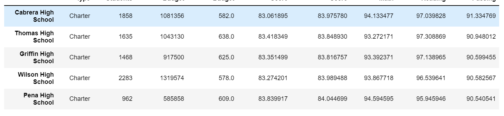

# School_District_Analysis
# Overview of the school district analysis
We were tasked to condense, calculate and sort the reading and math grades of a school district. 
# Results
How is the district summary affected?
-	The district summary went down by a small percentage.  
Original district summary:  
 
New district summary:  
 

How is the school summary affected?
-	The school summary went down overall very small.  
Original school summary:  
 
New school summary:  
 

How does replacing the ninth graders’ math and reading scores affect Thomas High School’s performance relative to the other schools?
-	Thomas High School stayed where it was.  
Original top 5:  
 
New top 5:  
 

How does replacing the ninth-grade scores affect the following:
-	Math and Reading scores by grade
  - It only brought down the 9th grade average. 
Original math scores by grade:  
 
New math scores by grade:  
 
Original reading scores by grade:  
 
New reading scores by grade:  

1.	Scores by school spending
  -	The school spending with Thomas High School went down a small percentage  
Original scores by school spending:  
 
New scores by school spending:  

-	Scores by school size
  -	The scores went down for the school size with Thomas High School  
Original scores by school size:  
 
New scores by school size:  
 
-	Scores by school type
  -	The scores went down for the school type with Thomas High School  
Original scores by school type:  
 
New scores by school type:  
 

# Summary
There were small changes in the 4 criteria’s:
1.	Scores by grade
2.	Scores by school spending
3.	Scores by school size
4.	Scores by school type
Each of these changes were very small. I had to format the code for extra decimal places to find differences. The reason for small changes is due to the amount of data affected. We are only affecting around 450 of 39,000 students. This small number will not change the data to much which is why I had to change the format. 
